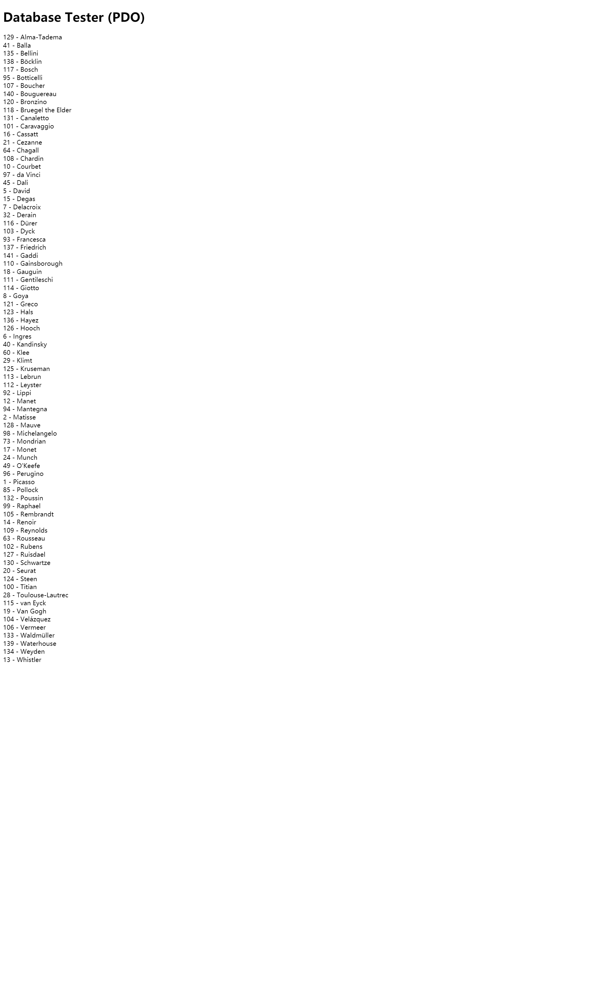
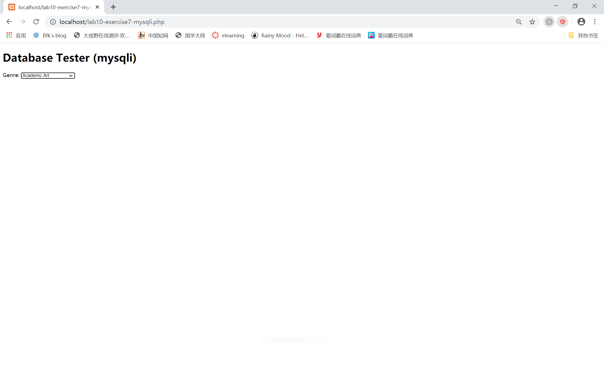
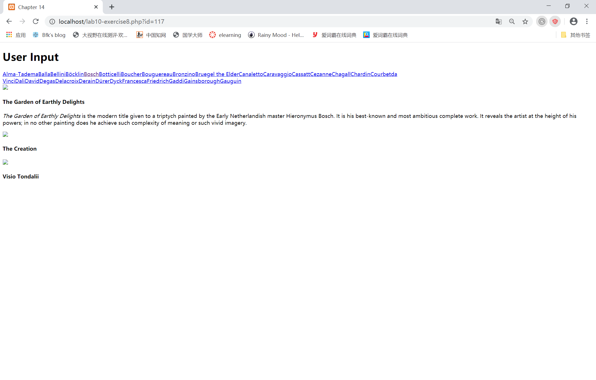

## Exercise7: MYSQL THROUGH PHP  

## Exercise8: INTEGRATING USER INPUTS (PDO)  

### 关于 outputArtists() 函数
初始化PDO对象的连接信息，设置错误处理方式为抛出异常
发送sql查询"select * from Artists order by LastName limit 0,30"，获得结果$result 
对于获取到的各条数据，用echo依次输出，其中，如果表单获取到的id与row数组中第ArtistID位相同，这一元素的class就设置为active。

### 关于 outputPaintings() 函数
发送sql语句'select * from Paintings where ArtistId=' . $_GET['id'];
按表单获取到的id选择相应的画
然后后调用outputSinglePainting()打印图片

### 关于 outputSinglePainting($row) 函数
其他函数传入$row数组，这个函数直接按此输出相应的html代码。

## Exercise9: PREPARED STATEMENTS  

### 执行sql语句的方法
1、使用exec()方法
当执行INSERT、UPDATE和DELETE等没有结果集的查询时，使用PDO对象中的exec()方法去执行。该方法成功执行后，将返回受影响的行数。该方法不能用于SELECT查询。

2、使用query()方法
当执行返回结果集的SELECT查询时，或者所影响的行数无关紧要时，应当使用PDO对象中的query()方法。如果该方法成功执行指定的查询，则返回一个PDOStatement对象。如果使用了query()方法，并想了解获取的数据行总数，可以使用PDOStatement对象中的rowCount()方法获取。

3、（使用 Prepared Statements）使用prepare()和execute()两个方法
当同一个查询需要多次执行时(有时需要迭代传入不同的列值)，使用预处理语句的方式来实现效率会更高。使用预处理语句就需要使用PDO对象中的prepare()方法去准备一个将要执行的查询，再使用PDOStatement对象中的execute()方法来执行。

### 使用 Prepared Statements的优点

1、带有预编译的特性，提高了效率

2、能够批量处理sql语句；

3、处理带未知参数的sql语句；

4、具有安全性，即可以防止恶意的sql语句注入攻击；

5、提高程序的可读性和可维护性。

