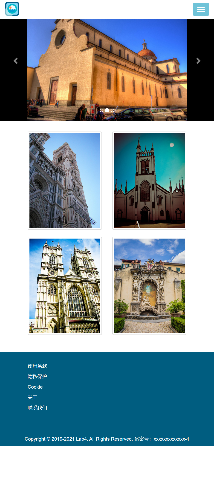

## 设计文档

### 采用的布局

整个页面分为四大块部分： 

最上方导航栏使用固定在页面顶部的navbar组件，navbar-brand中显示网站图标，Home、Browse、Search表单放置在导航栏左边（navbar-left），My account为下拉菜单，放置在导航栏右边（navbar-right）。 
这里采用响应式的导航栏，在小屏幕下将表单折叠起来，用折叠按钮控制导航栏元素是否展开。

第二部分使用轮播组件。图片自适应屏幕宽度，图片宽度占容器宽度的75%，居中。 

第三部分使用缩略图，放置四张图片。这里使用栅栏布局，每个div在超小屏幕中占六列，在中单屏幕中占三列。

最后一个部分采用了固定在页面底端的footer，仍然采用栅栏布局，每个div占六列。

### 设计
图标为自己绘制。

在index.css中重新设定了navbar按钮、菜单等组件的样式，使得页面始终以蓝色为主色调。

### 页面截图

