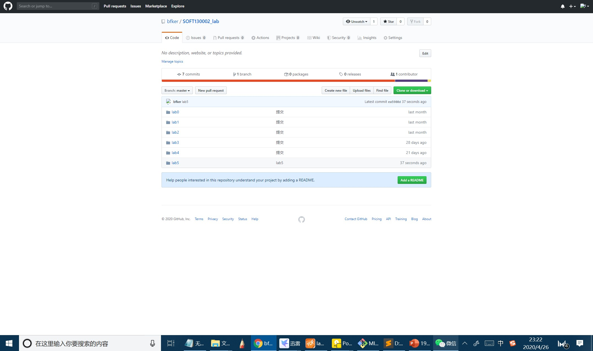
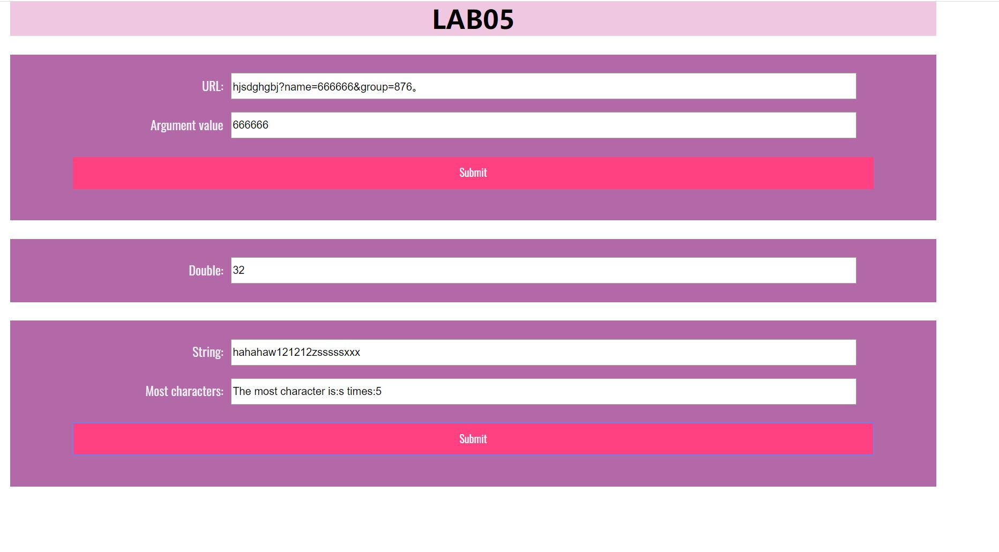

# Lab5设计文档
姓名：谢知然 
学号 19302010085 

## 函数相关知识点与解决方案 
1.**获取url中名为name的参数** 
知识点：字符串处理 
解决方案： 
使用String对象的方法 indexOf()和substring()， 
用indexOf()找到字符串"name="的位置和下一个"&"的位置（或者字符串末尾），使用substring()截取两者之间的字符串，即为name的参数。 

2.**每隔五秒运行一次函数直到某一整分钟停止** 
知识点：函数 
解决方案： 
使用 setInterval()方法和clearTimeout()方法，Date 对象获取当前秒数 
设置计时器，每隔5秒运行数字翻倍的函数，同时计数器+1。每隔一秒检验现在是否是整分。当整分或者计数器达到10时，用clearTimeout()方法使计时器停止 

3.**判断输入框most里出现最多的字符，并统计出来** 
知识点：for循环语句、数组 
解决方案：创建以字符作为下标的数组对象，for循环遍历字符串，统计各个字符出现次数，放在数组中。再遍历数组，保存最大值和相应的字符 

## 截图 
提交页面截图 
;
 
运行截图 

;
;