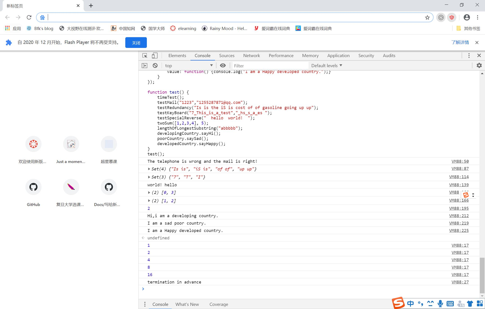
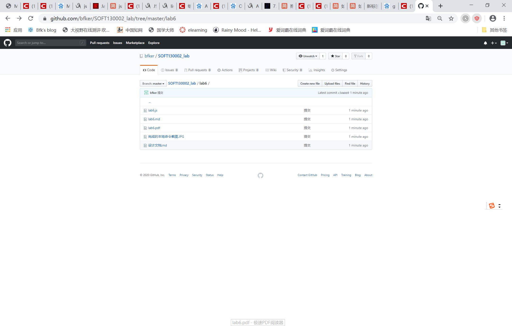

### 设计文档
（致歉：看错了ddl导致晚了一天，在之后由于准备物理半期又拖了一拖，最后就超期n天了）
#### 正则表达式
移动手机号码：
标准
- 十一位
- 以139、138、137、136、135、134、150、151、152、157、158、159、182、183、187、188、147开头

正则表达式：`^1(3[4-9]|5[012789]|8[78])\d{8}$`
`^1`  以1开头
`(3[4-9]|5[012789]|8[78])` 之后第二位是3时，第三位是4~9；第二位是5时，第三位是012789；第二位是8时，第三位是78；
`\d{8}` 之后有八位数字，直到结尾

邮箱：
正则表达式：`^\w+([\.-]?\w+)*@\w+([\.-]?\w+)+$`
标准
-`^\w+`以数字字母下划线开头
- `([\.-]?\w+)*`中间用任意个（可能为0个）.或者-分割
- `@\w+`名称和域名之间是@，域名是数字字母下划线开头
- `([\.-]?\w+)+$`域名中间用任意个（可能为0个）.或者-分割，直到结尾

第三题
`/\s+/` >=1个空格

#### 继承不同方式的理解
- 原型链继承
将new出来的父类的实例作为子类的原型（prototype）

- 构造函数继承
通过call访问父类构造方法，复制了父类构造函数的所有属性和方法，

- Object.create()
用这个方法创建一个新的对象，使得这个新对象以现有的对象作为原型

#### Array Set Map 区别使用
Array：朴素的数组，使用变量名来对应值，变量名只能是数字或者字符串
Set：一个集合，其中的元素互不重复。
Map：一个键值对的集合，其中键可以是任何类型的值

使用上，都可以for…of循环来遍历，内置forEach
Set和Array可以相互转换
Map和Array也可以相互转换

完成的本地命令截图

Github提交截图
